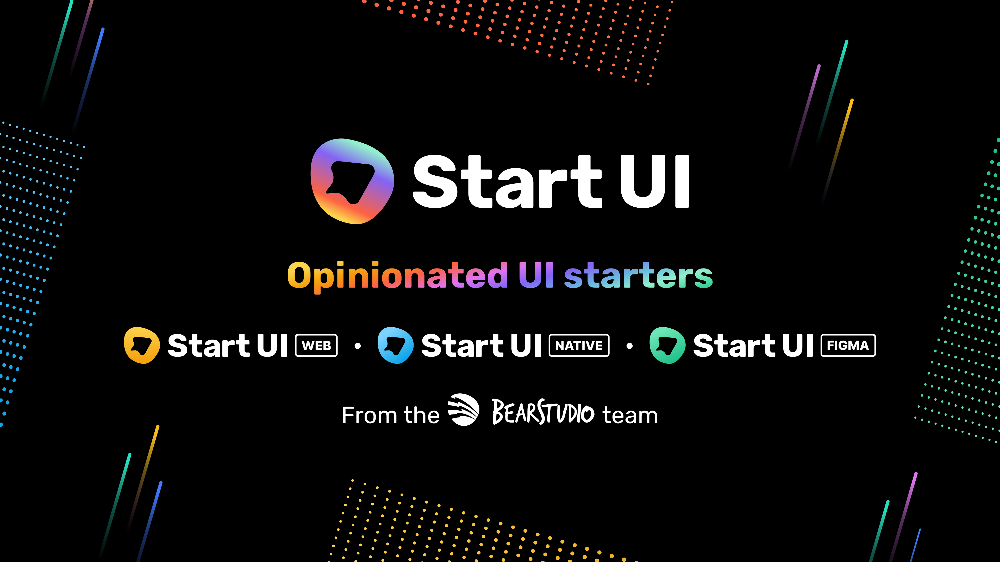

<h1 align="center">
  <a href="https://github.com/dec0dOS/amazing-github-template" >
    
  </a>
</h1>

<div align="center">
  Start UI Website
  <br />
  <a href="https://github.com/BearStudio/start-ui-website/issues">Report a Bug</a>
</div>

## Getting Started

First, install the dependencies and run the development server:

```bash
npm install
npm run dev
```

Open [http://localhost:3000](http://localhost:3000) with your browser to see the result.

This project uses [`next/font`](https://nextjs.org/docs/basic-features/font-optimization) to automatically optimize and load Rubik, a custom Google Font.

## Learn More

To learn more about Next.js, take a look at the following resources:

- [Next.js Documentation](https://nextjs.org/docs) - learn about Next.js features and API.
- [Learn Next.js](https://nextjs.org/learn) - an interactive Next.js tutorial.
